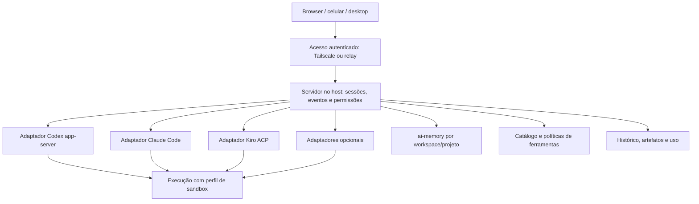

# Proposta de baseline do Adelic

Pesquisa de 04/10/2026. Este documento registra a proposta original, anterior à implementação. As capacidades abaixo vêm de documentação pública. A seleção e a arquitetura são recomendações para uma plataforma pessoal, sem benchmark comparativo entre agentes.

Após a pesquisa, o usuário autorizou uma interface web própria, inicialmente local, com roteamento adaptativo para evitar overhead em perguntas simples. O estado desse incremento está no [README](../README.md) e nas [specs](specs/requirements.md). As propostas de rede, pareamento e integração completa com ai-jail abaixo continuam sendo etapas futuras.

O objetivo é ter uma interface para conversar, escolher agentes, acompanhar execução e retomar trabalho de outros dispositivos, aproveitando assinaturas existentes e compartilhando memória, MCPs e práticas de desenvolvimento.

A recomendação inicial era reutilizar o T3 Code como interface e servidor de execução. Na etapa seguinte, o usuário escolheu iniciar um servidor e uma interface próprios; o T3 permanece como referência de experiência. A organização de versões, perfis por projeto, memória, skills e wrappers de sandbox orienta a evolução do Adelic.

**O que aproveitar de cada projeto**

| Projeto | Capacidade documentada que interessa | Aplicação proposta no Adelic |
| --- | --- | --- |
| [T3 Code](https://github.com/pingdotgg/t3code) | Controle de agentes locais por clientes web, desktop e mobile; integrações com vários runtimes. | Interface inicial e experiência de alternar projetos, agentes e dispositivos. |
| [Hermes](https://hermes-agent.nousresearch.com/docs/) | Gateway de mensagens, automações agendadas, memória e criação/reutilização de skills. | Assistência além de programação, canais opcionais e aprendizado de procedimentos. |
| [Codex app-server](https://developers.openai.com/codex/app-server) | Protocolo para sessões, turnos, eventos e interação com o runtime Codex. | Adaptador que preserva o runtime oficial, suas ferramentas e seus controles. |
| [Claude Code / Agent SDK](https://code.claude.com/docs/en/agent-sdk/overview) | Hooks, permissões, sessões, MCP, skills e subagentes. | Rotinas extensíveis e revisão especializada, com autenticação adequada ao modo de integração. |
| [Kiro Specs](https://kiro.dev/docs/specs/) | Requisitos, design e tarefas em arquivos; critérios de aceitação e acompanhamento da execução. | Fluxo de especificação para mudanças maiores; tarefas simples continuam diretas. |
| [Kiro ACP](https://kiro.dev/docs/cli/acp/) | CLI oficial controlável por JSON-RPC sobre stdin/stdout. | Integração Kiro através do agente oficial. |
| [Kiro Crew](https://kiro.dev/crew/) | Orquestração via ACP, dashboard, memória, schedules e apps extensíveis. | Referência adicional para rotinas e interfaces de trabalho; candidato a uma prova de conceito futura. |
| [OpenCode](https://opencode.ai/docs/server/) | Separação cliente/servidor e API de sessões e eventos. | Runtime adicional e caminho para provedores por API, com adaptador independente. |
| [Goose](https://goose-docs.ai/) | Extensões MCP e recipes que empacotam instruções, parâmetros e ferramentas. | Workflows portáveis e catálogo de capacidades habilitado por projeto. |
| [OpenHands](https://github.com/OpenHands/OpenHands) | Separação entre interface, Agent Server/SDK e serviço de automação. | Referência para executar trabalhos em workers e ambientes remotos. |
| [Aider](https://aider.chat/docs/repomap.html) | Mapa de repositório que seleciona contexto dentro de um orçamento de tokens. | Recuperação seletiva de código e contexto para sessões longas. |
| [OpenClaw](https://docs.openclaw.ai/concepts/architecture) | Gateway persistente, clientes remotos, identidade de dispositivos e canais de mensagens. | Referência para pareamento, acesso remoto e supervisão de serviços. |
| [ai-memory](https://github.com/akitaonrails/ai-memory) | Memória durável, escopos por workspace/projeto e handoff entre agentes. | Memória compartilhada de fatos, decisões e procedimentos. |
| [ai-jail](https://github.com/akitaonrails/ai-jail) | Restrições de filesystem, estado do agente e rede; backend Linux baseado em bubblewrap. | Execução isolada com perfis explícitos por projeto. |

Incorporar uma capacidade pode significar reutilizar o componente, escrever um adaptador ou adotar sua ideia. Copiar todos os runtimes para um mesmo repositório aumentaria muito a manutenção. O suporte aos agentes principais deve ser direto; os demais podem servir como referências ou integrações opcionais.

**Assinaturas e modelos**

A plataforma deve separar agente, modelo, conta e forma de cobrança. Claude executado pelo Kiro e Claude executado pelo Claude Code têm ferramentas, contexto, permissões e limites próprios. A interface precisa mostrar qual combinação está executando cada tarefa.

| Conta | Integração recomendada | Limitação relevante |
| --- | --- | --- |
| ChatGPT/Codex | Runtime Codex autenticado pelo fluxo oficial e controlado pelo app-server. | A assinatura tem seus próprios limites; uso com chave de API segue outra cobrança. |
| Claude Pro/Max | Controlar o Claude Code instalado no ambiente pessoal, preservando seu login oficial. | Não presumir autorização para oferecer login claude.ai em um produto de terceiros ou transformar o token da assinatura em API genérica. |
| Kiro | `kiro-cli acp`, mantendo autenticação e execução no CLI oficial. | Exige um cliente/adaptador ACP. A compatibilidade depende das capacidades e da versão do CLI. |
| APIs adicionais | Adaptadores com credenciais próprias e limite de gasto explícito. | São uma modalidade separada, que precisa ser escolhida pelo usuário. |

O Codex documenta [login por assinatura e por API](https://developers.openai.com/codex/auth). A OpenAI também documenta [uso de plano ChatGPT por apps open source/localmente hospedados](https://developers.openai.com/siwc/token-sharing-open-source), com consentimento OAuth e [limitações de preview](https://developers.openai.com/siwc/token-sharing-open-source/preview-limitations). Essa rota merece uma avaliação própria: o suporte da conta e um pedido de inferência concluído devem ser verificados antes de anunciá-la como disponível. Para o primeiro incremento, reutilizar o login do runtime reduz o trabalho.

O Claude Code aceita [Pro/Max na autenticação oficial](https://code.claude.com/docs/en/authentication). A documentação do [Agent SDK](https://code.claude.com/docs/en/agent-sdk/overview) restringe oferecer login e limites claude.ai em produtos de terceiros sem aprovação prévia e orienta usar autenticação por API nesse cenário. Uma instalação pessoal que controla o CLI e uma plataforma distribuída para outros usuários precisam ser avaliadas separadamente.

O [ACP oficial do Kiro](https://kiro.dev/docs/cli/acp/) permite manter o agente completo. Plugins de terceiros que acessam APIs do serviço diretamente devem ser opcionais, identificados como tal e avaliados separadamente do suporte oficial.

Não deve haver fallback silencioso da assinatura para uma API paga. Quando uma conta atinge o limite ou expira, a tarefa fica aguardando ou oferece uma troca explícita.

**Baseline funcional**

1. **Interface e sessões.** Projetos, conversas, seleção de agente/modelo/esforço, mensagens de progresso, ferramentas, anexos e artefatos. Usar uma sessão pelo computador e continuá-la pelo celular. Exibir a diferença entre executando, esperando aprovação, interrompido, concluído e falhou.
2. **Execução persistente.** O serviço no host mantém o trabalho quando o navegador fecha. Registrar mensagens antes de confirmar recebimento e reconciliar eventos após reconexão. Um reinício do host pode encerrar o processo do agente: a recuperação precisa preservar o estado e informar o que foi interrompido.
3. **Memória compartilhada.** ai-memory como referência durável para fatos e decisões; histórico operacional no armazenamento da plataforma; skills como procedimentos. Escopo explícito por usuário/workspace/projeto, origem e data dos fatos, correção de notas e exportação. Começar com recuperação textual, medindo se embeddings realmente são necessários.
4. **Sandbox por execução.** Limitar escrita ao checkout/worktree e aos diretórios de estado necessários. Disponibilizar credenciais apenas ao runtime que precisa delas, restringir rede conforme o perfil e verificar subprocessos e ferramentas remotas. Uma worktree organiza alterações; o isolamento de execução é responsabilidade do sistema operacional e das permissões das ferramentas.
5. **Catálogo MCP.** Memória, pesquisa/documentação, browser e integrações de projeto como conjunto inicial. Git e terminal podem continuar nativos no runtime. Configurar ferramentas por projeto, verificar saúde e timeout, fixar versões e evitar carregar catálogos inteiros em todos os prompts. Adaptar a configuração ao formato de cada cliente.
6. **Skills e regras.** Biblioteca comum versionada, carregada por relevância. Gerar os arquivos de integração exigidos por cada agente a partir de uma fonte mantida. Preservar diferenças semânticas de hooks e permissões em cada runtime. Aprendizados propostos precisam de evidência antes de virar regra permanente.
7. **Fluxo de desenvolvimento.** Explorar, especificar quando necessário, implementar, validar e revisar o diff. Vincular testes executados e artefatos ao resultado. Suportar revisão por outro agente e worktrees independentes quando o benefício justificar o custo.
8. **Controle de execução.** Cancelar um turno, enviar uma orientação durante o trabalho e responder a aprovações remotamente. Descobrir capacidades por adaptador; uma ação não suportada deve aparecer como indisponível. Evitar confirmações repetidas para tarefas já autorizadas.
9. **Uso e qualidade.** Mostrar provedor, duração, consumo disponível e falhas; distinguir dados medidos de estimativas. Avaliar fluxo completo, recuperação de contexto e correção do resultado com tarefas reais. Definir orçamentos para APIs e automações.
10. **Operação e dados.** Backup restaurável do histórico, memória e configurações, exportação, logs sanitizados, atualização por versões fixadas e rollback. Credenciais ficam no host ou em armazenamento apropriado; mensagens de log e memória não carregam segredos.

A interface deve distinguir o que já está disponível no runtime, o que exige adaptação e o que é apenas uma proposta. Um processo disponível ou um catálogo de modelos não comprovam autorização de conta nem execução bem-sucedida.

**Acesso pelo Tailscale e por conta**

O primeiro modo recomendado é privado: dispositivo conectado ao Tailscale, HTTPS para o serviço do host e regras de acesso limitadas ao operador. O [Tailscale Serve](https://tailscale.com/docs/features/tailscale-serve) publica um serviço local dentro da tailnet e exige habilitar os certificados HTTPS. Ele pode fornecer identidade do usuário ao backend através de headers; esses headers só devem ser aceitos pela entrada controlada do proxy, impedindo acesso direto que permita falsificação.

No MVP com T3, deve-se validar a combinação concreta de servidor, cliente e autenticação antes de disponibilizar esse modo. A identidade de rede não substitui automaticamente a autenticação exigida pelo T3. Usar um cliente remoto já suportado também é uma opção.

O [T3 Connect](https://github.com/pingdotgg/t3code/blob/main/docs/user/remote-access.md) já oferece acesso por conta e ambiente registrado, sem redirecionar portas do roteador. Ele depende do serviço de conexão do T3. Reutilizar esse acesso e construir um relay próprio são escolhas diferentes, com responsabilidades de operação diferentes.

Para uma interface Adelic acessível pela internet, propor login OIDC com Google/GitHub ou outro provedor, acesso limitado a contas autorizadas e registro do host com credencial de dispositivo revogável. O host inicia a conexão de saída para um relay; o navegador autenticado recebe acesso apenas aos ambientes autorizados. O backend associa identidade validada a permissões; comparar apenas um texto de e-mail seria insuficiente.

O login do Adelic autoriza controlar a máquina. Os logins Codex, Claude e Kiro autorizam usar cada provedor. Essas autorizações devem permanecer independentes. Para o primeiro uso pessoal, Tailscale permite adiar a operação de um relay público.

O computador que executa o agente precisa ficar ligado, acordado e conectado. Um host dedicado pode ser considerado depois, se disponibilidade contínua fizer parte do uso desejado.

**Arquitetura proposta para a evolução**

O diagrama descreve responsabilidades, sem afirmar que todos os componentes estão implementados. No primeiro incremento, o servidor T3 permanece proprietário das suas sessões e do seu banco; o Adelic fornece configuração e integração ao redor dele. Uma evolução com servidor próprio deve definir a migração dessa propriedade. Dois servidores não devem disputar a mesma sessão ou modificar o banco um do outro sem um contrato suportado.

[MCP](https://modelcontextprotocol.io/docs/learn/architecture) conecta ferramentas e dados. [ACP](https://agentclientprotocol.com/get-started/introduction) conecta clientes e agentes. Adaptadores nativos completam as diferenças. O projeto deve compartilhar contexto e artefatos respeitando esses limites.

Ao trocar de agente, manter a conversa visível e preparar um handoff com objetivo, decisões, arquivos alterados, testes e pendências. O novo runtime começa ou retoma sua própria sessão. Estado interno e IDs de ferramentas de um fornecedor não têm portabilidade automática para outro.

A [arquitetura do T3](https://github.com/pingdotgg/t3code/blob/main/docs/internals/overview.md) é uma referência útil para normalizar comandos/eventos e persistir intenção antes de executar efeitos. O desenho do Adelic deve separar reconexão de cliente, retomada de sessão e repetição de ações: uma mensagem reenviada não pode disparar duas execuções por acidente.

Para a evolução própria, TypeScript no servidor e React no cliente são candidatos coerentes com a integração T3; SQLite pode atender um host pessoal. Hermes/Python pode permanecer um processo separado. O volume e a concorrência medidos devem orientar a necessidade posterior de outros serviços de armazenamento e filas.

**Etapas e critérios de aceite**

| Etapa | Entrega proposta | Evidência necessária |
| --- | --- | --- |
| 1 — Baseline pessoal | T3 como superfície; Codex, Claude e Kiro; perfis de memória, MCP, skills e sandbox; acesso remoto privado. | Pelo celular na tailnet, enviar mensagem, receber resultado, responder a uma aprovação e cancelar/continuar. Confirmar qual conta executou cada tarefa. |
| 2 — Continuidade | Histórico e handoff entre agentes, recuperação de conexão, artefatos, backup e diagnóstico. | Fechar o browser sem parar trabalho; reenviar sem duplicar execução; retomar depois de falha; restaurar backup em ambiente isolado. |
| 3 — Workflows | Specs, revisão especializada, recipes, memória de procedimentos e automações delimitadas. | Executar uma tarefa representativa, comprovar critérios de aceitação e distinguir proposta de aprendizado de regra aplicada. |
| 4 — Plataforma própria | Interface/API Adelic, conta e registro de ambientes, múltiplos hosts e canais opcionais. | Validar isolamento de contas/projetos, revogação de host, atualização de protocolos e acesso externo autenticado. |

A integração de sandbox precisa de uma prova específica: leitura/escrita permitida no projeto, bloqueio de caminhos externos, autenticação e renovação do runtime, MCP e cancelamento de subprocessos. O funcionamento do CLI fora da jail não comprova esse conjunto.

O conjunto inicial de verificação deve incluir uma alteração pequena com teste, uma investigação com documentação, retomada de contexto em nova sessão e uma revisão de diff. Para a plataforma, cobrir também perda de conexão, aprovação pendente e falha de processo. Comparações de qualidade entre agentes precisam usar as mesmas tarefas e registrar diferenças de modelo, esforço e ferramentas.

A prioridade recomendada é concluir a etapa 1 e testar seu uso real antes de construir um relay próprio, múltiplos canais de chat ou uma orquestração ampla de agentes. A baseline ganha valor quando o mesmo trabalho pode ser conduzido de outro dispositivo com contexto, ferramentas e permissões consistentes.
